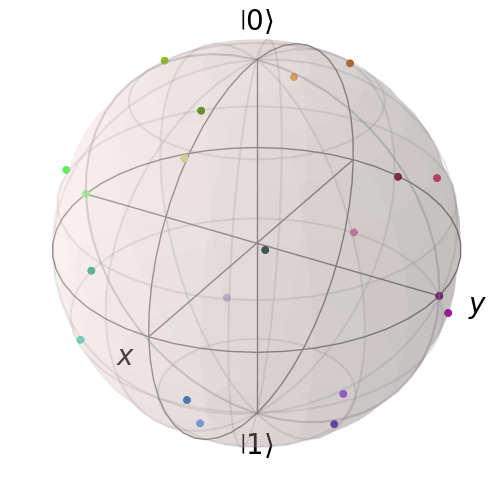
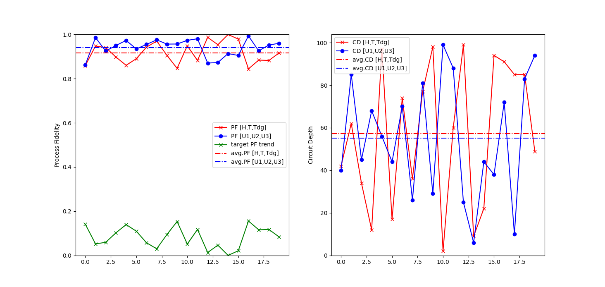

# Yet Another Quantum Quantizer

[](https://www.gnu.org/licenses/agpl-3.0)

The YAQQ (Yaqq Another Quantum Quantizer) is an agent that searches for novel quantum gate sets. Given a gate set, it can find a complementary gate that is performs better in certain transformation than the original gate set. It is possible theoretically because, (a) there are an infinite number of way of creating universal quantum computing gate sets, (b) for each discrete gate sets, there are certain quantum states which are easy to express, but many other quantum states which are exponentially costly. The cost, or the performance of a gate set, takes into account the fidelity when the gate set is used to decompose the target set of quantum transformations, and the circuit complexity of the decomposition.

### How to use:
1. Install dependencies (python 3.11.4, numpy 1.23.5, qiskit 0.43.3, astropy 5.3.1, matplotlib 3.7.2, scipy 1.11.1, tqdm 4.65.0, qutip 4.7.2, scikit-learn 1.3.0)
2. Navigate to codes folder
3. `>> python yaqq.py`

### Usage modes:

The first user menu choice is to either enter the `manual mode` or the `developer mode`. The developer mode is for testing certain features during development, and is a hardcoded shortcut for a specific selection of the manual mode. We recommend going into the former to access the full functionality of YAQQ.

The next choice is of the data set. Currently YAQQ only supports 1 qubit operations. The number of data points determines the runtime of the search, and the precision level for testing the gate sets on the Hilbert space. We have tested in orders of around 20 points.

The data set is of 3 types: (a) `equispaced points` on the Bloch sphere (pure states on 1 dimensional Hilbert space) generated by a golder ratio rotation on the spherical coordinate, (b) `Haar random pure states`, (c) `Haar random unitaries`. While the first two generated states, the later generated unitaries. All 3 types are stored as unitaries. For the first two, it denotes the unitary to transform from the |0> state. The later 2 should give similar result, as in principle, a Haar random unitary on any state (including the |0> state) is a Haar random state. We recommend using the first option, as it guarantees that the fidelity is bounded.

The data set can be visualized on the Bloch sphere. The unitary matrices in the data set are plotted as the target state when applied on the |0> state. The colours denote the x,y,z cartesian coordinate values.

Next, one needs to select the decomposition method. This can be either the `Solovay-Kitaev decomposition`, or a `Random decomposition`. While the Solovay-Kitaev theorem (SKT) guarantees that a small decomposition exist with bounded error, it is often hard to search that decomposed circuit, and in practise we found the random method to be more scalable.

The YAQQ operates in 2 modes: (a) it can `compare` two gate sets hardcoded based on the data set and decomposition method, (b) it can `generate` a novel complementary gate set based on the data set and decomposition method. The later option forms the core functionality of YAQQ. The former is mostly for generating further insights of already known gate sets.

If the generate mode is selected, the user has a further choice of the method used to search the space of gate sets. We currently support 2 methods: (a) `random` search, where new Haar random unitaries are used as gate set and their expressive power is evaluated, (b) an `optimization` routine finds the configuration for single qubit generalized rotation gates to form the gate set. 

### Example run:

```
(env) [path]>python yaqq.py

  ===> Run Default Configuration? [Y/N] (def.: Y): N

  ===> Enter Data Set Size (def.: 500): 20

  ===> Choose Data Set:
   Data Set 1 - Evenly distributed states (using golden mean)
   Data Set 2 - Haar random states
   Data Set 3 - Haar random unitaries
   Option (def.: 1): 1

  ===> Visualize Data Set? [Y/N] (def.: N): Y 

  ===> Choose Gate Decomposition Method:
   Method 1 - Solovay-Kitaev Decomposition
   Method 2 - Random Decomposition
   Option (def.: 2): 2

  ===> Choose YAQQ Mode:
   Mode 1 - Compare GS2 (in code) w.r.t. GS1 (in code)
   Mode 2 - Generative novel GS2 w.r.t. GS1 (in code)
   Option (def.: 2): 2

  ===> Choose Search Method:
   Method 1 - Random Gate Set Search
   Method 2 - U3 Angles SciPy L-BFGS-B/COBYLA with Multiple Random Initialization
   Option (def.: 1): 1

100%|██████████████████████████████████████████████████████████████████████████████████████████████████████████████████████████████████████████████████████████████████████████████████████████████████████████████| 20/20 [05:57<00:00, 17.85s/it]

Best settings found: {'U1': Instruction(name='unitary', num_qubits=1, num_clbits=0, params=[array([[ 0.16679561+0.66638905j, -0.48916454+0.53742247j],
       [-0.5800487 -0.43777662j, -0.04078379+0.68573451j]])]), 'U2': Instruction(name='unitary', num_qubits=1, num_clbits=0, params=[array([[ 0.23548325-0.07821723j,  0.94889751+0.19499543j],
       [-0.24920145+0.93612411j,  0.17513029-0.17578304j]])]), 'U3': Instruction(name='unitary', num_qubits=1, num_clbits=0, params=[array([[ 0.07294652-0.27161266j,  0.78939184-0.5456793j ],
       [-0.61955656+0.73284039j,  0.27740004-0.04630173j]])])}

Plot data? [Y/N] (def.: Y): Y
Save plots and data? [Y/N] (def.: N): N

Thank you for using YAQQ.
```

The plot of the data set:



The plot of the performance of the novel gate set with respect to [H, T, Tdg]. As we can see, we found a gate set (the unitary matrices of which are in the results above) that has higher fidelity and lower depth for expressing the data set.:


### Contributing:
Feel free to report issues during build or execution. We also welcome suggestions to improve the performance and features of this application.

### Influenced by:
1. [RuliadTrotter: meta-modeling Metamathematical observers](https://community.wolfram.com/groups/-/m/t/2575951)
2. [Visualizing Quantum Circuit Probability: Estimating Quantum State Complexity for Quantum Program Synthesis](https://www.mdpi.com/1099-4300/25/5/763)
3. [Automated Quantum Software Engineering: why? what? how?](https://arxiv.org/abs/2212.00619)
4. [Discovering Quantum Circuit Components with Program Synthesis](https://arxiv.org/abs/2305.01707)
5. [Automated Gadget Discovery in Science](https://arxiv.org/abs/2212.12743)
6. The YAQQ name is inspired by the [YACC](https://en.wikipedia.org/wiki/Yacc), it is a compiler-compiler, or a compiler-generator, in a similar way YAQQ provides the set of decompositions for the generated gate set.

### Development plans:
- [x] Compare distribution of standard (h,t,tdg) and (h,t,tdg) generated via custom U
- [x] If same, eliminate standard gate definitions, use only custom U
- [x] Plot "fidelity score" and "resource score"
- [x] Find two U gates in an overspecified gate set (u1,u1dg,u2,u2dg) such that it beats (h,t,tdg) in either of the 2 scores
- [x] Use U3 to produce points for benchmarking
- [x] Different optimizers
- [ ] See if tradeoff exists between gate set size and 2 scores
- [ ] Allow biases resource score, i.e. each gate in set can have a different cost (e.g. runtime on a QC)
- [ ] "Research and justify" cost function to optimize for choosing complimentarity, based on distribution of 2 scores on all mesh points (e.g. KL-div, JS-div, cross entropy) - current choice, Jensen-Shannon distance
- [ ] Tuning hyperparameters of cost function
- [ ] Equispaced states in higher dimension Hilbert space (under some distance measure)
- [ ] Bloch sphere states using hierarchical hex mesh (e.g. [H3: Uber's Hexagonal Hierarchical Spatial Index](https://github.com/uber/h3))
- [x] Plot fidelity/depth difference with colour on Bloch sphere like VQCP L/T topology
- [ ] Map projections
- [ ] Solovay Kiteav decomposition of higher number of qubits (>1)
- [ ] General 2 qubit gate with 15 free parameters
- [ ] PySimpleGUI
- [ ] Write paper
- [x] Use [setuptools](https://setuptools.pypa.io/en/latest/userguide/quickstart.html), [twine](https://twine.readthedocs.io/en/stable/index.html) for PyPI
- [ ] Plot gate set as points on [Weyl chamber](https://weylchamber.readthedocs.io/en/latest/tutorial.html), e.g., HxI, IxH, TxI, IxT, CX
- [ ] Given a set of noisy gates fabricated on a quantum processor, treat them as non-noisy and compile algorithms with that set. the noisy gates are first purified (i.e. should be unitary, but not the desired one, so it does not solve the problem of depolarizing)

### Citation:
If you find the repository useful, please consider citing:

```
@misc{YAQQ,
  author={Sarkar, Aritra and Kundu, Akash},
  title={YAQQ: Yet Another Quantum Quantizer},
  howpublished={\url{[https://github.com/Advanced-Research-Centre/YAQQ](https://github.com/Advanced-Research-Centre/YAQQ)}},
  year={2023}
}
```
